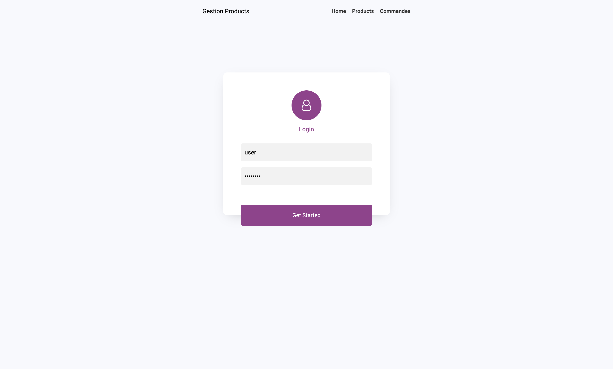
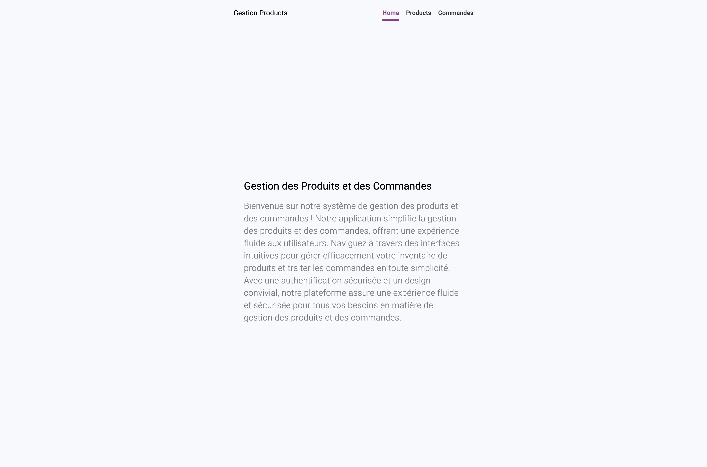
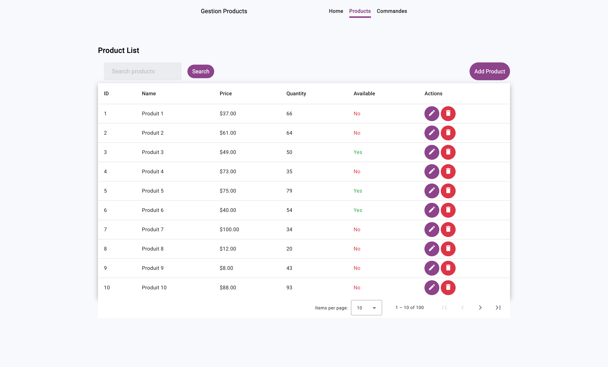
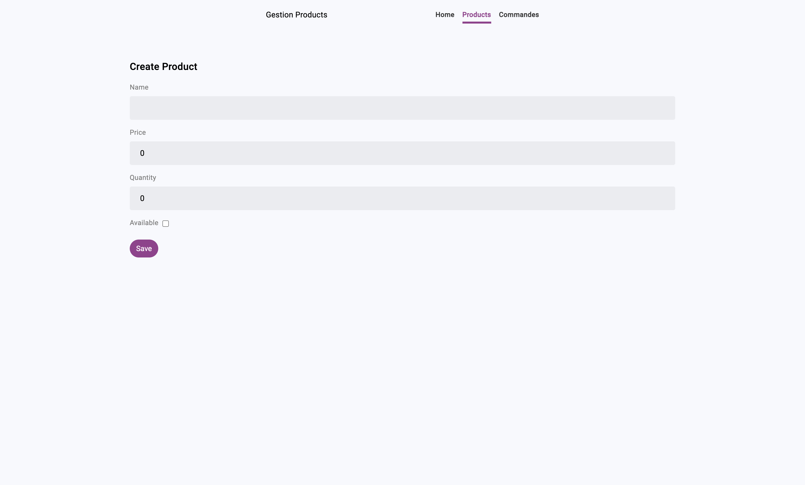
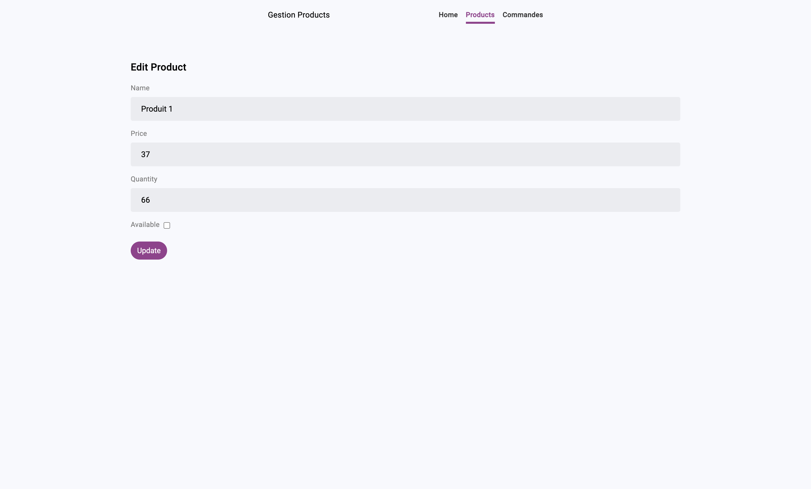

# Angular Product Management App

An Angular application for managing products with a microservice architecture, OAuth2, and Keycloak integration.

## Table of Contents
- [Introduction](#introduction)
- [Project Structure](#project-structure)
- [Features](#features)
- [Prerequisites](#prerequisites)
- [Installation](#installation)
- [Configuration](#configuration)
- [Usage](#usage)
- [Security](#security)
- [Contributing](#contributing)
- [License](#license)

## Introduction

This Angular application is designed for managing products in a microservice environment. It incorporates OAuth2 and Keycloak for robust security.

## Project Structure

- `/angular-gestion-produits`: Angular application source code
- `/microservices/micro_produit`: Microservice for product management (Java)
- `/microservices/micro_commande`: Microservice for order management (Java)
- `/microservices/oauth-keycloak`: Keycloak configuration

## Features
### 1. Front-Ennd
#### 1. Login

- **Description:** Secure user authentication with Keycloak to ensure access control.
- **Usage:** Users can log in using their credentials, and the application will authenticate them against the Keycloak server.

#### 2. Home

- **Description:** The home page serves as the main landing page for users, providing a brief overview and navigation options.
- **Usage:** Upon successful login, users are redirected to the home page, where they can navigate to different sections of the application.

#### 3. Product Listing
 Display a paginated list of products with details such as ID, name, price, quantity, and availability.

#### 4. Product Creating

Allow users to add product details, including the name, price, quantity, and availability.

#### 5. Product Updating

Allow users to update product details, including the name, price, quantity, and availability.

### 2. Back-End
- User authentication with Keycloak
- Microservice for product management
- Order management microservice
- Integration with Spring Cloud Gateway, Eureka Discovery, and Spring Cloud Config

## Prerequisites

Before getting started, ensure you have the following installed:

- [Node.js](https://nodejs.org/)
- [Angular CLI](https://angular.io/cli)
- [Java](https://www.java.com/)
- [Keycloak](https://www.keycloak.org/)
- [Docker](https://www.docker.com/)
- [JHipster](https://www.jhipster.tech/)

## Installation

1. Clone the repository: `git clone  https://github.com/bouhmouch-essaid/activit-epratique-finale-spring-angular-Keycloak.git`
2. Navigate to the project folder: `cd angular-gestion-produits`
3. Install Angular dependencies: `npm install`
4. Navigate to the microservices folder: `cd microservices`
5. Install microservice dependencies: `./mvnw clean install`
7. Install order service dependencies: `./mvnw clean install`

## Usage

1. Start the microservices for the backend:
   - In `/microservice/**`, run: `./mvnw`
2. Start the Angular development server: `ng serve`
3. Open the application in your browser: `http://localhost:4200`

## Contributing

Feel free to contribute to the project by opening issues or submitting pull requests.

## License

This project is licensed under the [MIT License](LICENSE).